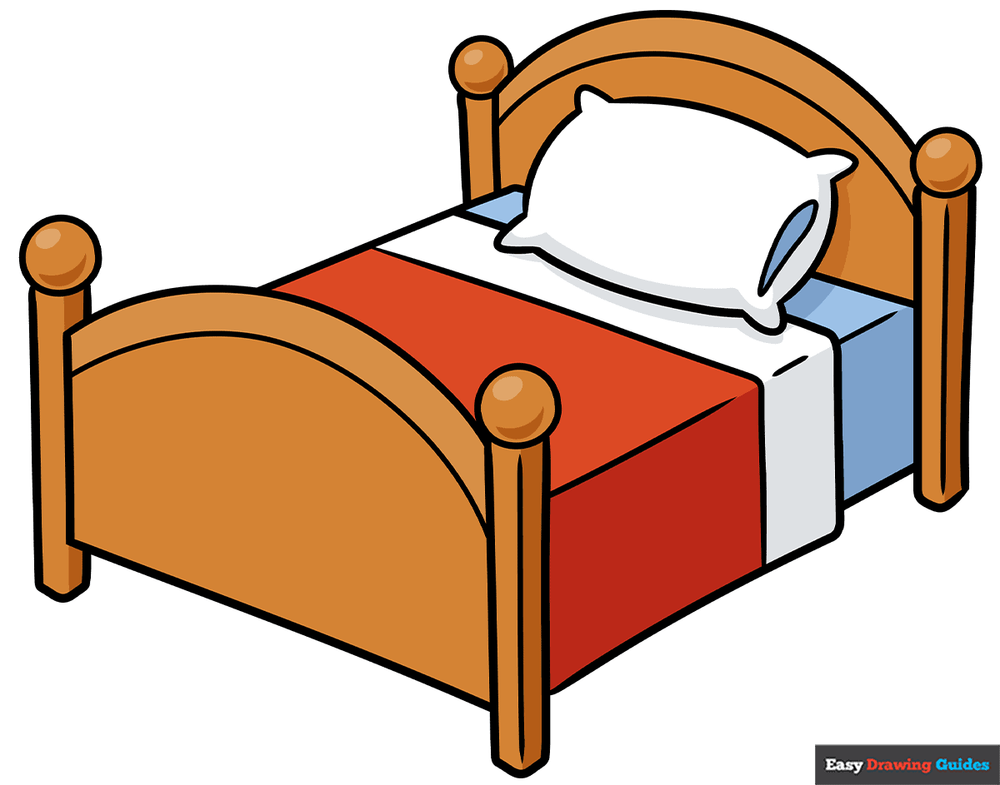

# My Greatest Fear

### Part 1

My greatest fear is **sleeping in** too late in the mornings. Sometimes I stay up too late at night finishing *homework* and *robotics work* and I end up going back to bed after turning off my alarm. This usually ends terribly with me waking up minutes before I have to go and catch my bus. 

### Part 2 - **The Story**
	
On a cold rainy day a while ago I was up late finishing the *pew pew shooter game*. It was around 1:00AM and I was starting to become very productive. I stayed up late working on it since I am most productive and work better late at night. I eventually went to bed when it was getting past 🕝AM (2:30). When I woke up at my normal time the next morning I turned off my alarm and stayed in bed. I fell asleep again for 15 minutes and woke up right before I had to leave for my bus. I frantically got ready and ran out the door and barely made it to my bus on time. 

### part 3 - **The Aftermath**

I learned my lesson from this however I am still afraid of accidentally falling asleep after turning off my alarms. I don't put my phone next to my bed anymore which causes me to actually have to get out of bed to turn it off. This has seemed to solve my issue however if I forget to turn my alarm back on after being away the day before, I still do miss my bus. 

## The END
<button>Login</button>
#### Written by Elijah and proofread by Chat GPT
